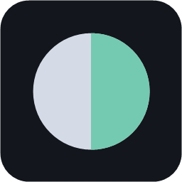
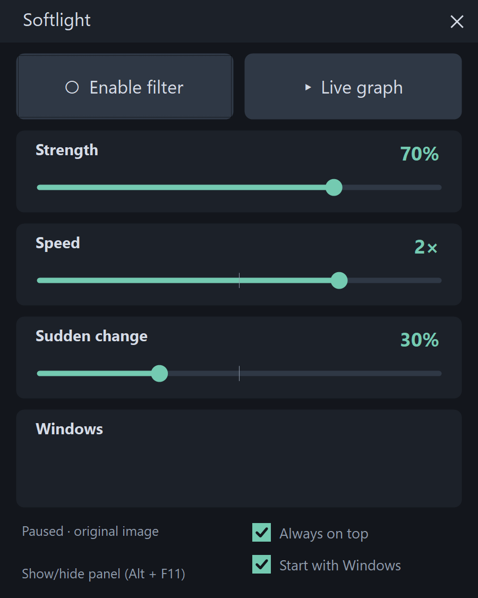

# Softlight

**Calmer windows. Softer light.**

Softlight is a small Windows tray app that automatically dims bright application windows. It adjusts the entire window uniformly, rather than compressing only its highlights, so shadows and highlights receive the same dimming factor.



## Download

Get the installer or portable ZIP from [Releases](https://github.com/Artllex/Softlight/releases).

- **Installer:** installs for the current user without administrator rights, adds a Start menu shortcut and an uninstaller.
- **Portable:** extract the entire ZIP and run `Softlight.exe`. Keep the DLL and assets folder alongside it.

Windows 10 version 2004 or newer, or Windows 11, x64. Uses .NET Framework 4.8 and Direct3D 11. The application is not code-signed; Windows may display a reputation warning.

## Firefox integration (2.1.0)

The installer and portable package include the Firefox extension and native host. Follow [Firefox setup](FIREFOX.md) to load the unsigned extension temporarily. It must be loaded again after restarting Firefox.

## Features

- Independent Firefox Player/Page dimming with immediate response to large video cuts in either direction and slow smoothing of smaller changes.
- Collapsible Brightness/Dim graph with ten-second history and Freeze.
- Automatic whole-window dimming for SDR and HDR desktops.
- Strength, response speed and sudden-change response controls.
- Remembers settings between launches; defaults are 70%, 2× and 30%.
- Retains the last dimming level of hidden or covered windows while the engine runs.
- Ignores small target fluctuations within two percentage points.
- Accelerates dimming after large brightness increases.
- Flash protection presents already-dimmed frames to reduce bright-frame leaks, with a tray switch to return to lower-latency masks.
- Tray menu with 120, 60, 30, 12 and 4 Hz analysis options, and a 30 fps power-saving option.
- English and Polish interface, optional startup with Windows and always-on-top panel.



## Usage

Click **Enable filter** to start. **Alt + F11** or a left click on the tray icon shows or hides the panel. Right-click the tray icon for frequency, power-saving, language and exit options.

**Always on top** keeps the panel visible and prevents hiding it with the shortcut or tray icon until unpinned. **Start with Windows** launches it in the tray, unless pinned.

Settings live in `%LOCALAPPDATA%\NocnyFiltrWindows\settings.ini`, retaining compatibility with development builds. Exiting saves settings and removes the overlays. Uninstalling preserves settings.

## How it works and limitations

Softlight samples the desktop through DXGI Desktop Duplication, identifies visible application windows and draws click-through surfaces using DirectComposition. With **Flash protection** enabled (the default), those surfaces display already-dimmed captured frames. Turning it off restores transparent black masks over the live desktop. It does not change the monitor's hardware brightness. Its surfaces are excluded from capture to avoid recursive dimming. HDR composition uses linear scRGB.

With the [Firefox companion extension](FIREFOX.md), the largest visible player is dimmed independently from the rest of the browser window. Without it, browsers are treated as whole windows. Only visible areas contribute to brightness analysis. Flash protection adds image latency and ties visible motion to the processing frame rate; Save power limits it to 30 fps. It protects already covered regions, but initial coverage, moving/new windows and capture resets can still expose live frames. Protected video may appear black; disable Flash protection in that case. Exclusive fullscreen games and multiple physical displays have not been comprehensively validated. Transparent and irregular windows are approximated by rectangles.

The selected analysis frequency is a target, not a guaranteed refresh rate. Emergency brightness detection checks fresh captured frames even at lower selected rates. All processing stays on the device; the app does not upload screen content or window titles.

## Build

Install Visual Studio Build Tools with **Desktop development with C++**, a Windows SDK and the .NET Framework compiler. Run in PowerShell:

```powershell
./Build.ps1 -BuildDirectory "$PWD/build"
./Package.ps1 -IsccPath "C:/Program Files/Inno Setup 7/ISCC.exe"
```

Packaging requires Inno Setup 7. Outputs appear in `dist/`. GitHub Actions builds the same artifacts on Windows.

## Validation

```powershell
Start-Process ./Softlight.exe -ArgumentList '--self-test test-results/self-test.txt' -Wait
Start-Process ./Softlight.exe -ArgumentList '--interface-check test-results/interface.txt' -Wait
```

Create `test-results` first. The interface check needs an interactive desktop and a free Alt+F11 shortcut; close other Softlight instances first. `--smoke-test` exercises real desktop capture and temporarily displays test windows. Numeric tests include GPU/CPU agreement, HDR, whole-window alpha, jitter stabilization and settings persistence.

## License

[MIT](LICENSE). Copyright © 2026 Artllex.
